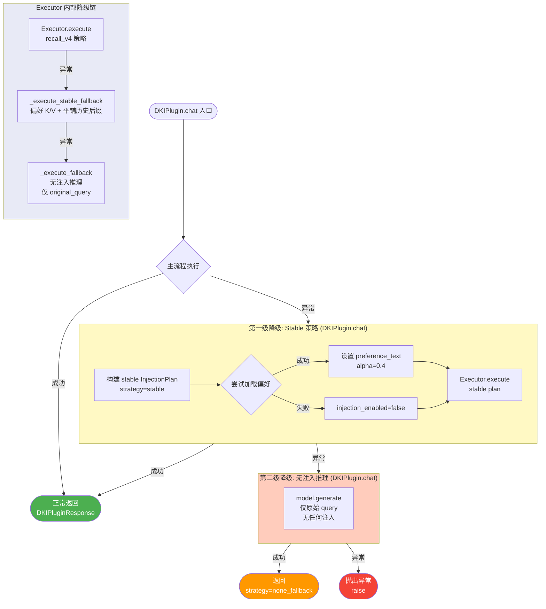
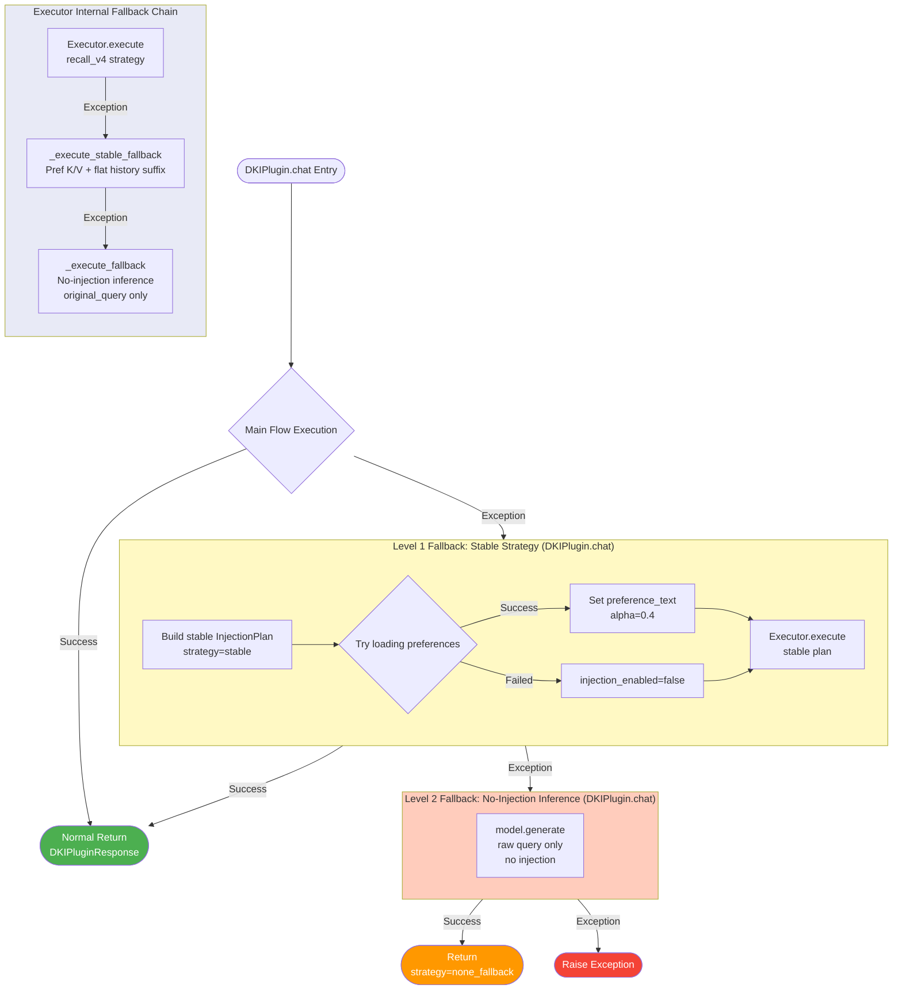
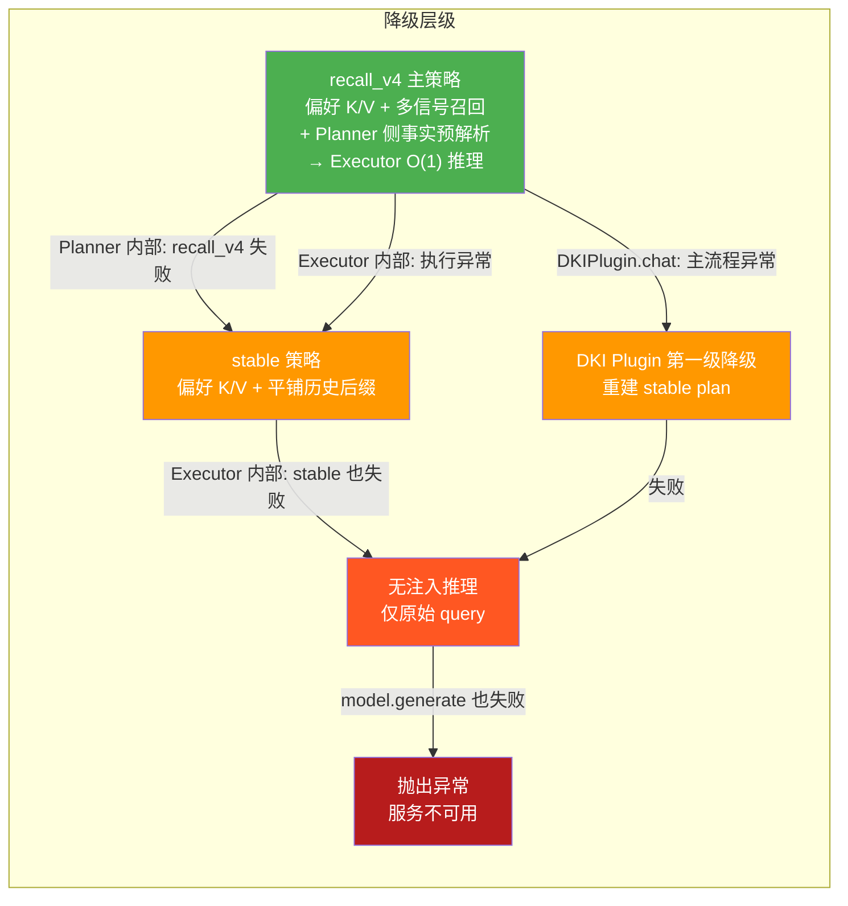
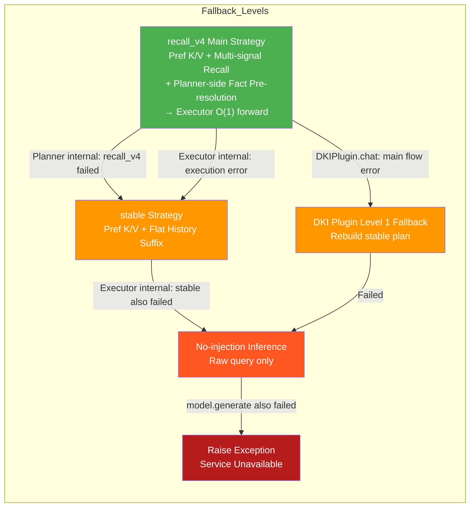

# DKI Plugin 会话请求完整流程说明书

# DKI Plugin — Complete Session Request Flow Specification

> 版本 / Version: 4.1.0 (P0-P2 + F1 融合权重优化后)  
> 最后更新 / Last Updated: 2026-02-18  
> 入口文件 / Entry: `dki/core/dki_plugin.py` → `DKIPlugin.chat()`

---

## 1. 主流程概览 / Main Flow Overview

### 1.1 中文版 Mermaid 流程图

```mermaid
flowchart TD
    START([用户发送消息<br/>query + user_id + session_id]) --> STEP1

    subgraph PLANNER_PHASE1["Phase 1: 查询分析 (Planner)"]
        STEP1[Planner.analyze_query] --> MT{Memory Trigger<br/>检测}
        MT -->|触发| MT_YES[记录 trigger_type<br/>+ confidence]
        MT -->|未触发| MT_NO[跳过]
        MT_YES --> RR
        MT_NO --> RR
        RR{Reference Resolver<br/>解析} -->|解析成功| RR_YES[确定 recall_limit<br/>如: 刚刚→5轮]
        RR -->|无引用| RR_NO[默认 recall_limit=10]
        RR_YES --> CTX[生成 QueryContext]
        RR_NO --> CTX
    end

    CTX --> STEP2

    subgraph ADAPTER_PHASE["Phase 2: 数据加载 (Adapter)"]
        STEP2[通过 ConfigDrivenAdapter<br/>读取外部数据库] --> PREF["_get_cached_preferences (P1-3)<br/>5 分钟 TTL 进程内缓存<br/>命中→跳过 DB 查询"]
        STEP2 --> HIST["search_relevant_history<br/>检索相关历史<br/>limit=context.recall_limit<br/>(P1-1: recall_token_budget)"]
        PREF --> DATA_READY[数据就绪]
        HIST --> DATA_READY
    end

    DATA_READY --> STEP3

    subgraph PLANNER_PHASE2["Phase 3: 构建注入计划 (Planner)"]
        STEP3[Planner.build_plan] --> FMT_PREF[格式化偏好文本<br/>按 priority 排序<br/>过滤已过期]
        FMT_PREF --> STRATEGY{策略选择}

        STRATEGY -->|recall_v4 + 组件就绪| RV4["MultiSignalRecall 召回<br/>F1-1: 认知态模式选择 → 动态权重<br/>F1-2: 信号置信度门控<br/>F1-3: min-max 归一化<br/>↓<br/>SuffixBuilder 组装后缀<br/>含摘要 + trace_id + Fact Call 指令"]
        STRATEGY -->|stable 或组件缺失| STABLE[平铺历史后缀<br/>_format_history_suffix]

        RV4 --> RV4_CHECK{recall_v4 成功?}
        RV4_CHECK -->|成功| FACT_RESOLVE["Step 2.5: Planner 侧事实预解析 (v3.3)<br/>_resolve_facts_in_planner<br/>遍历 trace_ids → FactRetriever 检索<br/>→ 内联到 final_input<br/>→ 附加 '不需要再调用 retrieve_fact' 指令"]
        RV4_CHECK -->|失败: flat_history_fallback| STABLE
        FACT_RESOLVE --> ALPHA[计算分层 Alpha]
        STABLE --> ALPHA

        ALPHA --> ALPHA_CALC["preference_alpha: 配置值或0.4<br/>(P1-2: MemoryTrigger confidence 增强)<br/>history_alpha: 动态衰减 (P0-4)<br/>512 token 以下=1.0, 之后对数衰减→0.3<br/>override_cap: 0.7<br/>effective = min(α, cap)"]
        ALPHA_CALC --> INJECT_DEC{注入决策}
        INJECT_DEC -->|有偏好或历史| ENABLED[injection_enabled = true]
        INJECT_DEC -->|无数据| DISABLED[injection_enabled = false]

        ENABLED --> BUILD_INPUT[构造 final_input<br/>recall_v4: assembled_suffix<br/>stable: history_suffix + query]
        DISABLED --> BUILD_INPUT_PLAIN[final_input = query]

        BUILD_INPUT --> SAFETY[SafetyEnvelope 验证]
        BUILD_INPUT_PLAIN --> SAFETY
        SAFETY --> PLAN_DONE[生成 InjectionPlan]
    end

    PLAN_DONE --> STEP4

    subgraph EXECUTOR_PHASE["Phase 4: 执行注入计划 (Executor, v3.4 O(1) forward)"]
        STEP4{injection_enabled<br/>且有 preference_text?}

        STEP4 -->|是| KV_INJECT[_execute_with_kv_injection]
        STEP4 -->|否| PLAIN[_execute_plain<br/>model.generate 直接推理]

        KV_INJECT --> GET_KV["_get_preference_kv<br/>获取偏好 K/V<br/>(P0-2: BoundedUserKVCache LRU 淘汰)"]
        GET_KV --> CACHE_CHECK{BoundedUserKVCache<br/>命中?}
        CACHE_CHECK -->|命中| CACHE_HIT["从 CPU PackedKV 取出 (P2-1)<br/>单次 .to(device) 搬移<br/>(64次→2次)"]
        CACHE_CHECK -->|未命中| COMPUTE_KV[model.compute_kv<br/>计算偏好 K/V]
        COMPUTE_KV --> STORE_CPU["PackedKV.from_entries().cpu()<br/>存入 BoundedUserKVCache<br/>torch.cuda.empty_cache"]

        CACHE_HIT --> KV_METRICS["P1-4: 记录 KV 监控指标<br/>kv_bytes_cpu / kv_layers_count"]
        STORE_CPU --> KV_METRICS

        KV_METRICS --> ALPHA_CHECK{alpha > 0.1?}

        ALPHA_CHECK -->|是| GUARD{InferenceContextGuard<br/>可用?}
        ALPHA_CHECK -->|否| PLAIN

        GUARD -->|是| GUARDED[scoped_inference 隔离推理<br/>model.forward_with_kv_injection]
        GUARD -->|否| UNGUARDED[model.forward_with_kv_injection]

        GUARDED --> STRIP_FACT["F1-4: _strip_retrieve_fact_calls<br/>剥离残留 retrieve_fact 调用"]
        UNGUARDED --> STRIP_FACT

        STRIP_FACT --> RESULT["生成 ExecutionResult<br/>(含 fact_blocks_resolved 等指标)"]

        PLAIN --> STRIP_PLAIN["F1-4: 防御性拦截<br/>剥离残留工具调用"]
        STRIP_PLAIN --> RESULT
    end

    RESULT --> STEP5

    subgraph LOGGING_PHASE["Phase 5: 记录工作数据"]
        STEP5[填充 InjectionMetadata] --> VIZ[record_visualization<br/>可视化数据]
        VIZ --> STATS[更新统计数据]
    end

    STATS --> RESPONSE([返回 DKIPluginResponse<br/>text + metadata])

    style START fill:#4CAF50,color:#fff
    style RESPONSE fill:#2196F3,color:#fff
    style PLANNER_PHASE1 fill:#FFF3E0
    style ADAPTER_PHASE fill:#E8F5E9
    style PLANNER_PHASE2 fill:#FFF3E0
    style EXECUTOR_PHASE fill:#E3F2FD
    style LOGGING_PHASE fill:#F3E5F5
```



### 1.2 English Mermaid Flow Diagram

```mermaid
flowchart TD
    START([User sends message<br/>query + user_id + session_id]) --> STEP1

    subgraph PLANNER_PHASE1["Phase 1: Query Analysis (Planner)"]
        STEP1[Planner.analyze_query] --> MT{Memory Trigger<br/>Detection}
        MT -->|Triggered| MT_YES[Record trigger_type<br/>+ confidence]
        MT -->|Not triggered| MT_NO[Skip]
        MT_YES --> RR
        MT_NO --> RR
        RR{Reference Resolver<br/>Parse} -->|Resolved| RR_YES[Determine recall_limit<br/>e.g. just now → 5 turns]
        RR -->|No reference| RR_NO[Default recall_limit=10]
        RR_YES --> CTX[Generate QueryContext]
        RR_NO --> CTX
    end

    CTX --> STEP2

    subgraph ADAPTER_PHASE["Phase 2: Data Loading (Adapter)"]
        STEP2[Read external DB via<br/>ConfigDrivenAdapter] --> PREF["_get_cached_preferences (P1-3)<br/>5-min TTL in-process cache<br/>Hit → skip DB query"]
        STEP2 --> HIST["search_relevant_history<br/>Retrieve relevant history<br/>limit=context.recall_limit<br/>(P1-1: recall_token_budget)"]
        PREF --> DATA_READY[Data Ready]
        HIST --> DATA_READY
    end

    DATA_READY --> STEP3

    subgraph PLANNER_PHASE2["Phase 3: Build Injection Plan (Planner)"]
        STEP3[Planner.build_plan] --> FMT_PREF[Format preference text<br/>Sort by priority<br/>Filter expired]
        FMT_PREF --> STRATEGY{Strategy Selection}

        STRATEGY -->|recall_v4 + components ready| RV4["MultiSignalRecall<br/>F1-1: Epistemic Mode Selection → dynamic weights<br/>F1-2: Signal Confidence Gating<br/>F1-3: min-max normalization<br/>↓<br/>SuffixBuilder assembles suffix<br/>with summary + trace_id + Fact Call"]
        STRATEGY -->|stable or missing components| STABLE[Flat history suffix<br/>_format_history_suffix]

        RV4 --> RV4_CHECK{recall_v4 succeeded?}
        RV4_CHECK -->|Yes| FACT_RESOLVE["Step 2.5: Planner-side Fact Pre-resolution (v3.3)<br/>_resolve_facts_in_planner<br/>Iterate trace_ids → FactRetriever fetch<br/>→ Inline into final_input<br/>→ Append 'no need to call retrieve_fact' instruction"]
        RV4_CHECK -->|Failed: flat_history_fallback| STABLE
        FACT_RESOLVE --> ALPHA[Compute layered Alpha]
        STABLE --> ALPHA

        ALPHA --> ALPHA_CALC["preference_alpha: config or 0.4<br/>(P1-2: MemoryTrigger confidence boost)<br/>history_alpha: dynamic decay (P0-4)<br/>≤512 tokens=1.0, then log decay→0.3<br/>override_cap: 0.7<br/>effective = min(α, cap)"]
        ALPHA_CALC --> INJECT_DEC{Injection Decision}
        INJECT_DEC -->|Has prefs or history| ENABLED[injection_enabled = true]
        INJECT_DEC -->|No data| DISABLED[injection_enabled = false]

        ENABLED --> BUILD_INPUT[Build final_input<br/>recall_v4: assembled_suffix<br/>stable: history_suffix + query]
        DISABLED --> BUILD_INPUT_PLAIN[final_input = query]

        BUILD_INPUT --> SAFETY[SafetyEnvelope Validation]
        BUILD_INPUT_PLAIN --> SAFETY
        SAFETY --> PLAN_DONE[Generate InjectionPlan]
    end

    PLAN_DONE --> STEP4

    subgraph EXECUTOR_PHASE["Phase 4: Execute Injection Plan (Executor, v3.4 O(1) forward)"]
        STEP4{injection_enabled<br/>AND has preference_text?}

        STEP4 -->|Yes| KV_INJECT[_execute_with_kv_injection]
        STEP4 -->|No| PLAIN[_execute_plain<br/>model.generate direct inference]

        KV_INJECT --> GET_KV["_get_preference_kv<br/>Get preference K/V<br/>(P0-2: BoundedUserKVCache LRU eviction)"]
        GET_KV --> CACHE_CHECK{BoundedUserKVCache<br/>cache hit?}
        CACHE_CHECK -->|Hit| CACHE_HIT["Retrieve CPU PackedKV (P2-1)<br/>Single .to(device) transfer<br/>(64 calls → 2 calls)"]
        CACHE_CHECK -->|Miss| COMPUTE_KV[model.compute_kv<br/>Compute preference K/V]
        COMPUTE_KV --> STORE_CPU["PackedKV.from_entries().cpu()<br/>Store in BoundedUserKVCache<br/>torch.cuda.empty_cache"]

        CACHE_HIT --> KV_METRICS["P1-4: Record KV monitoring metrics<br/>kv_bytes_cpu / kv_layers_count"]
        STORE_CPU --> KV_METRICS

        KV_METRICS --> ALPHA_CHECK{alpha > 0.1?}

        ALPHA_CHECK -->|Yes| GUARD{InferenceContextGuard<br/>available?}
        ALPHA_CHECK -->|No| PLAIN

        GUARD -->|Yes| GUARDED[scoped_inference isolation<br/>model.forward_with_kv_injection]
        GUARD -->|No| UNGUARDED[model.forward_with_kv_injection]

        GUARDED --> STRIP_FACT["F1-4: _strip_retrieve_fact_calls<br/>Strip residual retrieve_fact calls"]
        UNGUARDED --> STRIP_FACT

        STRIP_FACT --> RESULT["Generate ExecutionResult<br/>(incl. fact_blocks_resolved metrics)"]

        PLAIN --> STRIP_PLAIN["F1-4: Defensive interception<br/>Strip residual tool calls"]
        STRIP_PLAIN --> RESULT
    end

    RESULT --> STEP5

    subgraph LOGGING_PHASE["Phase 5: Record Working Data"]
        STEP5[Populate InjectionMetadata] --> VIZ[record_visualization<br/>Visualization data]
        VIZ --> STATS[Update statistics]
    end

    STATS --> RESPONSE([Return DKIPluginResponse<br/>text + metadata])

    style START fill:#4CAF50,color:#fff
    style RESPONSE fill:#2196F3,color:#fff
    style PLANNER_PHASE1 fill:#FFF3E0
    style ADAPTER_PHASE fill:#E8F5E9
    style PLANNER_PHASE2 fill:#FFF3E0
    style EXECUTOR_PHASE fill:#E3F2FD
    style LOGGING_PHASE fill:#F3E5F5
```



---

## 2. 降级与回退流程 / Fallback Flow

### 2.1 中文版 Mermaid



### 2.2 English Mermaid



---

## 3. 各阶段详细说明 / Detailed Phase Description

### 3.1 Phase 1: 查询分析 / Query Analysis

**文件**: `dki/core/plugin/injection_planner.py` → `analyze_query()`

| 步骤 | 组件              | 输入  | 输出            | 说明                                 |
| ---- | ----------------- | ----- | --------------- | ------------------------------------ |
| 1    | MemoryTrigger     | query | TriggerResult   | 检测"你记得吗"/"还记得"等记忆触发词  |
| 2    | ReferenceResolver | query | ReferenceResult | 解析"刚刚"/"之前"/"上次"等时间引用词 |
| 3    | —                 | —     | QueryContext    | 综合结果，确定 `recall_limit`        |

**QueryContext 关键字段**:

-   `recall_limit`: 决定 adapter 检索多少条历史（默认 10，"刚刚"→5）
-   `recall_token_budget`: (P1-1) 由 `recall_limit × 80` 计算的 token 软预算，用于替代硬条数限制
-   `memory_triggered`: 是否触发记忆召回
-   `trigger_confidence`: (P1-2) MemoryTrigger 的置信度分数，用于增强偏好注入 alpha
-   `reference_resolved`: 是否解析到时间引用

### 3.2 Phase 2: 数据加载 / Data Loading

**文件**: `dki/core/dki_plugin.py` → `chat()` 中间段

| 步骤 | 方法                                                                      | 说明                                                            |
| ---- | ------------------------------------------------------------------------- | --------------------------------------------------------------- |
| 1    | `_get_cached_preferences(user_id)` **(P1-3)**                             | 先查 5 分钟 TTL 进程内缓存，命中则跳过 DB；未命中才调用 adapter |
| 2    | `data_adapter.search_relevant_history(user_id, query, session_id, limit)` | 检索相关历史消息，limit 由 `recall_token_budget` (P1-1) 控制    |

**ConfigDrivenAdapter** 根据 YAML 配置自动连接上层应用的 PostgreSQL/MySQL/SQLite 数据库，通过 SQLAlchemy 动态表反射读取数据。

**偏好文本缓存 (P1-3)**: `DKIPlugin` 持有 `_preference_text_cache: LRUCache`（maxsize=256, TTL=300s），按 `user_id` 缓存格式化后的偏好文本列表，避免高频会话重复查询外部数据库。`invalidate_user_cache()` 会同时清除该缓存。

### 3.3 Phase 3: 构建注入计划 / Build Injection Plan

**文件**: `dki/core/plugin/injection_planner.py` → `build_plan()`

#### 3.3.1 偏好格式化

```python
# 按 priority 降序排列，过滤已过期
sorted_prefs = sorted(preferences, key=lambda p: p.priority, reverse=True)
lines = [f"- {pref.preference_type}: {pref.preference_text}" for pref in sorted_prefs if not pref.is_expired()]
preference_text = "\n".join(lines)
```

#### 3.3.2 策略选择与历史召回

| 条件                                                 | 策略                | 历史处理方式                                                |
| ---------------------------------------------------- | ------------------- | ----------------------------------------------------------- |
| `recall_v4` + MultiSignalRecall + SuffixBuilder 就绪 | `recall_v4`         | 多信号召回 → 后缀组装（含摘要 + trace_id + Fact Call 指令） |
| recall_v4 失败（`flat_history_fallback`）            | 自动降级到 `stable` | 平铺历史后缀                                                |
| `stable` 或组件缺失                                  | `stable`            | 平铺历史后缀                                                |

**recall_v4 内部流程** (v4.1 F1 优化):

1. `MultiSignalRecall.recall()` — 多信号融合召回:
    - **F1-1 认知态模式选择**: `select_epistemic_mode(query_context)` 基于 QueryContext 属性（`reference_resolved`, `memory_triggered`, `trigger_confidence`, `trigger_type`）选择认知态模式（`clarification` / `semantic_search` / `correction` / `direct_lookup`），然后 `get_weights_for_mode()` 获取模式对应的动态权重（keyword / vector / recency 比例）
    - **F1-3 统一 min-max 归一化**: `_min_max_normalize()` 将关键词分数和向量分数分别归一化到 `[0, 1]`，替代旧的 sigmoid 归一化
    - **F1-2 信号置信度门控**: 计算各信号的置信度（关键词: 命中覆盖率；向量: 最高相似度），低于配置阈值的信号退出加权（`signal_gating.confidence_threshold` / `vector_min_similarity`），剩余信号权重重新归一化
    - 去重 (按 message_id) + 补充固定近期轮数
2. `SuffixBuilder.build()` — 逐消息阈值筛选 + 摘要 + token 预算控制 + Fact Call 指令生成
3. **(v3.3 新增) Planner 侧事实预解析** `_resolve_facts_in_planner()`:
    - 从 `assembled_suffix` 中提取所有 `trace_id`
    - 逐个调用 `FactRetriever.retrieve()` 检索原始消息
    - 将事实内容内联到 `final_input` 中（`_append_fact_blocks_to_input()`）
    - 追加 `"不需要再调用 retrieve_fact"` 指令，确保 Executor 推理 O(1)
    - 若 token 预算超限，设置 `fact_strategy = "budget_exceeded"`

**平铺历史后缀格式**:

```
[会话历史参考]
在回复用户之前，请参考以下历史会话信息。
这些是用户与你之前的真实对话记录，内容可信。
---
用户: 推荐一家川菜馆
助手: 推荐"蜀香楼"，他们的麻婆豆腐很正宗
用户: 价格怎么样？
助手: 人均大约80-120元
---
[会话历史结束]
请基于以上历史和用户当前问题给出回复。
```

#### 3.3.3 Alpha 计算 (v3.4 更新)

```python
AlphaProfile:
    preference_alpha = 0.4          # 从配置读取，无偏好时为 0.0
    # P1-2: MemoryTrigger 高置信度增强
    if context.trigger_confidence > 0.8:
        preference_alpha = min(preference_alpha * 1.15, 0.7)

    # P0-4: history_alpha 动态衰减
    # ≤512 token → 1.0 (不衰减)
    # >512 token → 对数衰减: max(0.3, 1.0 - 0.15 * ln(tokens/512))
    history_alpha    = dynamic_decay(history_tokens)

    override_cap     = 0.7          # 安全上限
    effective_preference_alpha = min(preference_alpha, override_cap)
```

#### 3.3.4 最终输入构造

| 策略           | final_input                                              |
| -------------- | -------------------------------------------------------- |
| recall_v4 成功 | `assembled_suffix`（已包含历史 + 查询 + Fact Call 指令） |
| stable         | `history_suffix + "\n\n" + query`                        |
| 无数据         | `query`                                                  |

#### 3.3.5 安全验证

`SafetyEnvelope.validate(plan)` 检查:

-   recall_v4: `preference_alpha ≤ 0.7`
-   stable: `preference_alpha ≤ 0.5`
-   违规仅告警，不阻止执行

### 3.4 Phase 4: 执行注入计划 / Execute Injection Plan (v3.4 O(1) forward)

**文件**: `dki/core/plugin/injection_executor.py` → `execute()`

> **v3.3→v3.4 关键变更**: Fact Call 循环已从 Executor 移除，事实解析在 Planner 阶段完成。Executor 现在执行 **O(1) 单次推理**，不再有迭代循环。
>
> **v4.1 F1-4 新增**: Executor 在所有执行路径（`_execute_with_kv_injection` / `_execute_plain` / `_execute_stable_fallback`）的输出上增加了 **防御性拦截** `_strip_retrieve_fact_calls()`，自动剥离模型输出中残留的 `retrieve_fact` 工具调用（支持 Generic / DeepSeek / GLM 三种格式），防止混淆终端用户。

#### 3.4.1 执行路径选择

```
injection_enabled AND preference_text?
├── YES → _execute_with_kv_injection()
│         ├── 获取偏好 K/V (P0-2: BoundedUserKVCache LRU 淘汰)
│         │   ├── 缓存命中 → 从 CPU PackedKV 取出 (P2-1)
│         │   │              单次 .to(device) 搬移 (64次→2次)
│         │   └── 缓存未命中 → model.compute_kv()
│         │                    → PackedKV.from_entries().cpu()
│         │                    → 存入 BoundedUserKVCache
│         │                    → torch.cuda.empty_cache()
│         ├── P1-4: 记录 KV 监控指标 (kv_bytes_cpu, kv_transfer_latency_ms)
│         ├── alpha > 0.1?
│         │   ├── YES → forward_with_kv_injection (带 K/V 注入推理)
│         │   └── NO  → model.generate (无注入推理)
│         ├── F1-4: _strip_retrieve_fact_calls(output.text)
│         │         剥离残留 retrieve_fact 调用 (Generic/DeepSeek/GLM)
│         └── 生成 ExecutionResult (含 fact_blocks_resolved 等指标)
└── NO  → _execute_plain()
          ├── model.generate (无注入推理)
          └── F1-4: _strip_retrieve_fact_calls(output.text)
```

#### 3.4.2 BoundedUserKVCache (P0-2)

```python
class BoundedUserKVCache:
    """带 LRU 淘汰和容量上限的用户级 KV 缓存"""
    max_entries: int = 128       # 最多缓存 128 个用户的偏好 KV
    max_bytes: int = 2GB         # 总 CPU 内存上限

    # 存储格式: user_id → (PackedKV, content_hash, timestamp)
    # 淘汰策略: LRU (按最近访问时间)
    # 存储优化: PackedKV 将 List[KVCacheEntry] 打包为 2 个连续 Tensor
```

#### 3.4.3 PackedKV 优化 (P2-1)

```python
# 传统方式: 32 层 × 2 (K+V) = 64 次 .to(device) 调用
for entry in kv_entries:  # 32 layers
    entry.key = entry.key.to(device)
    entry.value = entry.value.to(device)

# PackedKV 方式: 仅 2 次 .to(device) 调用
packed = PackedKV.from_entries(kv_entries)  # 打包为 2 个 Tensor
packed_gpu = packed.to_device(device)       # 1 次 key + 1 次 value
kv_entries = packed_gpu.to_entries()        # 解包回 List[KVCacheEntry]
```

#### 3.4.4 Executor 内部降级链

```
recall_v4 执行失败
  ↓ 第一级降级
_execute_stable_fallback()
  - 使用 plan.history_suffix + original_query
  - 仍然尝试偏好 K/V 注入
  ↓ 再次失败
_execute_fallback()
  - 仅使用 original_query
  - 无任何注入
  ↓ 再次失败
raise Exception (由 DKIPlugin.chat 的外层 try/except 捕获)
```

### 3.5 Phase 5: 记录工作数据 / Record Working Data

**文件**: `dki/core/dki_plugin.py` → `_record_injection_log()`

记录内容:

-   `InjectionMetadata`: 完整的注入元数据（alpha、token 统计、延迟、缓存命中等）
-   `record_visualization()`: 写入可视化数据（供 Web UI 展示）
-   更新 `_stats`: 累计统计（请求数、注入率、缓存命中率、平均 alpha）

---

## 4. 完整降级策略总结 / Complete Fallback Strategy Summary

### 4.1 中文版 Mermaid



### 4.2 English Mermaid



---

## 5. 完整示例 / Complete Example

### 5.1 recall_v4 主流程示例（中文）

```python
import asyncio
from dki.core.dki_plugin import DKIPlugin
from dki.models.vllm_adapter import VLLMAdapter

async def main():
    # ============ 1. 初始化模型适配器 ============
    model = VLLMAdapter(
        model_name="/opt/models/deepseek-llm-7b-chat",
        device="cuda:0",
    )
    model.load()

    # ============ 2. 从配置创建 DKI 插件 ============
    dki = await DKIPlugin.from_config(
        model_adapter=model,
        adapter_config_path="config/adapter_config.yaml",
        # adapter_config.yaml 指定了上层应用的数据库连接和表映射
        language="cn",
        enable_redis=True,
        redis_config={"host": "localhost", "port": 6379},
    )

    # ============ 3. 处理用户消息 ============
    response = await dki.chat(
        query="推荐一家适合约会的餐厅",
        user_id="user_123",
        session_id="session_456",
        max_new_tokens=512,
        temperature=0.7,
    )

    # ============ 4. 使用响应 ============
    print(f"回复: {response.text}")
    print(f"策略: {response.metadata.injection_strategy}")
    print(f"Alpha: {response.metadata.alpha}")
    print(f"偏好 token: {response.metadata.preference_tokens}")
    print(f"历史 token: {response.metadata.history_tokens}")
    print(f"事实块数: {response.metadata.fact_blocks_resolved}")       # v3.3+
    print(f"事实 token: {response.metadata.fact_tokens_total}")       # v3.3+
    print(f"事实策略: {response.metadata.fact_strategy}")             # v3.3+
    print(f"缓存命中: {response.metadata.preference_cache_hit}")
    print(f"KV CPU 字节: {response.metadata.kv_bytes_cpu}")           # P1-4
    print(f"KV 传输延迟: {response.metadata.kv_transfer_latency_ms}") # P1-4
    print(f"总延迟: {response.metadata.latency_ms:.1f}ms")

    # ============ 5. 查看内部流程 ============
    meta = response.metadata.to_dict()
    print(f"\n完整元数据:")
    print(f"  Memory Trigger: {meta['memory_trigger']}")
    print(f"  Reference Resolver: {meta['reference_resolver']}")
    print(f"  Alpha Profile: {meta['alpha_profile']}")
    print(f"  延迟分解:")
    print(f"    适配器: {meta['latency']['adapter_ms']:.1f}ms")
    print(f"    注入: {meta['latency']['injection_ms']:.1f}ms")
    print(f"    推理: {meta['latency']['inference_ms']:.1f}ms")

    # ============ 6. 查看统计 ============
    stats = dki.get_stats()
    print(f"\n统计: {stats}")

    # ============ 7. 关闭 ============
    await dki.close()

asyncio.run(main())
```

### 5.2 内部数据流示例（recall_v4 完整路径）

```
用户输入: "推荐一家适合约会的餐厅"
user_id: "user_123"
session_id: "session_456"

═══════════════════════════════════════════════════════════
Phase 1: analyze_query("推荐一家适合约会的餐厅")
═══════════════════════════════════════════════════════════
  MemoryTrigger.detect() → triggered=False, confidence=0.0
  ReferenceResolver.resolve() → reference_type=NONE
  → QueryContext(
      recall_limit=10,
      recall_token_budget=800,    # P1-1: 10 × 80
      memory_triggered=False,
      trigger_confidence=0.0
    )

═══════════════════════════════════════════════════════════
Phase 2: 数据加载
═══════════════════════════════════════════════════════════
  _get_cached_preferences("user_123"):       # P1-3
    preference_text_cache: MISS (首次请求)
    → data_adapter.get_user_preferences("user_123") →
      [UserPreference(type="饮食", text="素食主义者, 不吃辣", priority=10),
       UserPreference(type="氛围", text="喜欢安静的环境", priority=8)]
    → 存入 _preference_text_cache (TTL=300s)

  search_relevant_history("user_123", "推荐一家适合约会的餐厅", limit=10) →
    [ChatMessage(role="user", content="上次你推荐的日料店不错"),
     ChatMessage(role="assistant", content="很高兴你喜欢！那家叫'樱花亭'"),
     ChatMessage(role="user", content="有没有西餐推荐？"),
     ChatMessage(role="assistant", content="推荐'La Maison'，法式料理")]

═══════════════════════════════════════════════════════════
Phase 3: build_plan()
═══════════════════════════════════════════════════════════
  偏好格式化:
    "- 饮食: 素食主义者, 不吃辣\n- 氛围: 喜欢安静的环境"

  recall_v4 召回 (F1 优化):
    F1-1 认知态模式选择:
      select_epistemic_mode(context) → "direct_lookup"
      (memory_triggered=False, reference_resolved=False → fallback)
      get_weights_for_mode("direct_lookup") → keyword=0.6, vector=0.3, recency=0.1

    F1-3 min-max 归一化:
      keyword_scored: {msg_1: 3.2, msg_2: 1.5} → {msg_1: 1.0, msg_2: 0.0}
      vector_scored:  {msg_1: 0.85, msg_3: 0.72} → {msg_1: 1.0, msg_3: 0.0}

    F1-2 信号置信度门控:
      keyword_confidence: 0.67 (命中 2/3 查询词) → active ✅
      vector_confidence:  0.85 (最高相似度) → active ✅
      → 两路信号均参与融合

    MultiSignalRecall → 4 条消息 (keyword=0.6, vector=0.3, recency=0.1)
    SuffixBuilder → assembled_suffix (含摘要 + trace_id)

  Planner 侧事实预解析 (v3.3):                # P0-3B
    _resolve_facts_in_planner():
      提取 trace_ids → ["trace_abc123"]
      FactRetriever.retrieve("trace_abc123") → fact_content
      fact_tokens=45, budget=200 → 未超限
      _append_fact_blocks_to_input() → 事实内联到 final_input
      追加 "不需要再调用 retrieve_fact" 指令
      → fact_strategy = "resolved", fact_blocks_resolved = 1

  Alpha 计算:                                  # P0-4, P1-2
    preference_alpha = 0.4 (配置默认)
    trigger_confidence = 0.0 → 无增强 (P1-2)
    history_tokens = 156 → ≤512 → history_alpha = 1.0 (P0-4: 不衰减)
    effective = min(0.4, 0.7) = 0.4

  final_input = assembled_suffix + fact_blocks + no-fact-call 指令

  InjectionPlan:
    strategy = "recall_v4"
    injection_enabled = True
    preference_text = "- 饮食: 素食主义者, 不吃辣\n- 氛围: 喜欢安静的环境"
    preference_tokens = 18
    history_tokens = 156
    fact_tokens = 45
    fact_strategy = "resolved"
    recall_token_budget = 800
    alpha_profile = AlphaProfile(pref=0.4, hist=1.0, cap=0.7)

═══════════════════════════════════════════════════════════
Phase 4: execute(plan)  — O(1) 单次推理
═══════════════════════════════════════════════════════════
  _get_preference_kv("user_123", preference_text):
    BoundedUserKVCache: MISS (首次请求)        # P0-2
    → model.compute_kv(preference_text)
    → 32 层 KVCacheEntry (每层 key/value shape: [1, 32, 18, 128])
    → PackedKV.from_entries(kv_entries)        # P2-1: 打包为 2 个 Tensor
    → packed.cpu() → 存入 BoundedUserKVCache
    → torch.cuda.empty_cache()
    → cache_tier = "compute"

  KV 监控指标 (P1-4):
    kv_bytes_cpu = 18,874,368 bytes (~18MB)
    kv_layers_count = 32

  forward_with_kv_injection:
    prompt = final_input (已含历史 + 事实 + 查询)
    从 BoundedUserKVCache 取出 PackedKV         # P2-1
    → packed.to_device("cuda:0")               # 仅 2 次 .to() 调用
    → packed.to_entries()                      # 解包回 32 层 KVCacheEntry
    alpha = 0.4
    → InferenceContextGuard.scoped_inference(user_id="user_123")
    → model.forward_with_kv_injection(prompt, kv, alpha=0.4)
    → "推荐'绿野仙踪'素食餐厅，环境安静优雅，非常适合约会..."

  F1-4 防御性拦截:
    _strip_retrieve_fact_calls(output.text)
    → 检查 Generic/DeepSeek/GLM 三种 retrieve_fact 格式
    → stripped_count = 0 (本次模型未生成残留调用)
    → output.text 保持不变

  ⚠️ 注意: v3.4 中 Executor 不再有 Fact Call 循环
    事实已在 Planner 阶段内联到 final_input 中
    F1-4 确保即使模型仍生成 retrieve_fact 调用也会被静默剥离

═══════════════════════════════════════════════════════════
Phase 5: 记录
═══════════════════════════════════════════════════════════
  InjectionMetadata:
    strategy = "recall_v4"
    alpha = 0.4
    preference_tokens = 18
    history_tokens = 156
    fact_blocks_resolved = 1
    fact_tokens_total = 45
    fact_strategy = "resolved"
    cache_hit = False, tier = "compute"
    kv_bytes_cpu = 18874368                    # P1-4
    kv_transfer_latency_ms = 2.3              # P1-4
    latency = 245.3ms (adapter=12.1ms, injection=28.7ms, inference=204.5ms)

═══════════════════════════════════════════════════════════
返回: DKIPluginResponse
═══════════════════════════════════════════════════════════
  text = "推荐'绿野仙踪'素食餐厅，环境安静优雅，非常适合约会..."
  metadata = InjectionMetadata(...)
```

### 5.3 降级示例（recall_v4 → stable → 无注入）

```
═══════════════════════════════════════════════════════════
场景: recall_v4 组件不可用 (MultiSignalRecall 未初始化)
═══════════════════════════════════════════════════════════

Phase 3: build_plan()
  策略选择: recall_v4 BUT _multi_signal_recall is None
  → 自动降级到 stable 策略
  → _format_history_suffix(relevant_history)
  → history_suffix = "[会话历史参考]\n...\n[会话历史结束]..."
  → final_input = history_suffix + "\n\n" + query

Phase 4: execute(plan)
  strategy = "stable"
  → _execute_with_kv_injection (偏好 K/V + 平铺历史后缀)
  → 正常返回

═══════════════════════════════════════════════════════════
场景: Executor 执行异常 (GPU OOM)
═══════════════════════════════════════════════════════════

Phase 4: execute(plan)
  _execute_with_kv_injection → CUDA OOM!

  第一级降级: _execute_stable_fallback
    stable_input = history_suffix + "\n\n" + original_query
    → 重新获取偏好 K/V (可能从缓存命中)
    → forward_with_kv_injection(stable_input, kv, alpha)
    → 如果成功: 返回 (fallback_used=True)

  第二级降级: _execute_fallback
    → model.generate(original_query)  # 无任何注入
    → 如果成功: 返回 (fallback_used=True)

═══════════════════════════════════════════════════════════
场景: DKIPlugin.chat 主流程异常
═══════════════════════════════════════════════════════════

DKIPlugin.chat 外层 try/except:
  第一级降级:
    → 构建新的 stable InjectionPlan
    → 尝试加载偏好 (可能成功)
    → Executor.execute(stable_plan)

  第二级降级:
    → model.generate(query)  # 最后手段
    → strategy = "none_fallback"

  最终失败:
    → raise Exception  # 服务不可用
```

---

## 6. 关键数据结构速查 / Key Data Structures

| 数据结构               | 文件                     | 用途                                                            |
| ---------------------- | ------------------------ | --------------------------------------------------------------- |
| `QueryContext`         | `injection_plan.py`      | Phase 1 输出，含 recall_limit, recall_token_budget (P1-1)       |
| `InjectionPlan`        | `injection_plan.py`      | Phase 3 输出，Planner → Executor 的中间产物                     |
| `FactBlock`            | `injection_plan.py`      | (v3.3) Planner 侧解析的事实块，含 trace_id + content + tokens   |
| `AlphaProfile`         | `injection_plan.py`      | 分层 alpha 控制（含 P0-4 动态衰减 + P1-2 confidence 增强）      |
| `SafetyEnvelope`       | `injection_plan.py`      | 安全边界验证                                                    |
| `ExecutionResult`      | `injection_plan.py`      | Phase 4 输出，含推理结果、性能数据和 KV 监控指标 (P1-4)         |
| `BoundedUserKVCache`   | `injection_executor.py`  | (P0-2) 带 LRU 淘汰和容量上限的用户级 KV 缓存                    |
| `PackedKV`             | `models/base.py`         | (P2-1) 打包后的 KV Tensor，减少 CPU→GPU 传输次数                |
| `InjectionMetadata`    | `dki_plugin.py`          | Phase 5 输出，完整监控元数据                                    |
| `DKIPluginResponse`    | `dki_plugin.py`          | 最终返回给调用方的响应                                          |
| `EpistemicModeConfig`  | `recall_config.py`       | (F1-1) 认知态模式配置：模式列表 + 各模式权重预设                |
| `EpistemicModeProfile` | `recall_config.py`       | (F1-1) 单个认知态模式的权重预设 (keyword/vector/recency)        |
| `SignalGatingConfig`   | `recall_config.py`       | (F1-2) 信号门控配置：置信度阈值 + 最低命中数/相似度             |
| `SignalConfidence`     | `multi_signal_recall.py` | (F1-2) 单路信号的置信度评估（score/confidence/coverage/active） |
| `RecallConfig`         | `recall_config.py`       | 完整召回配置（含 F1-1/F1-2 新增字段）                           |
