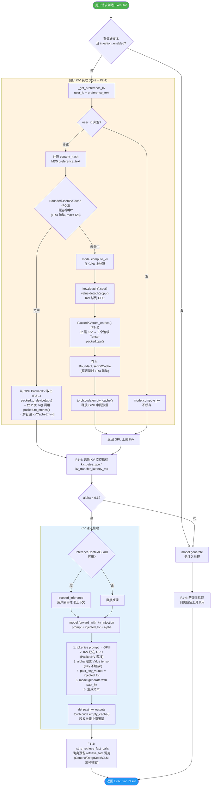
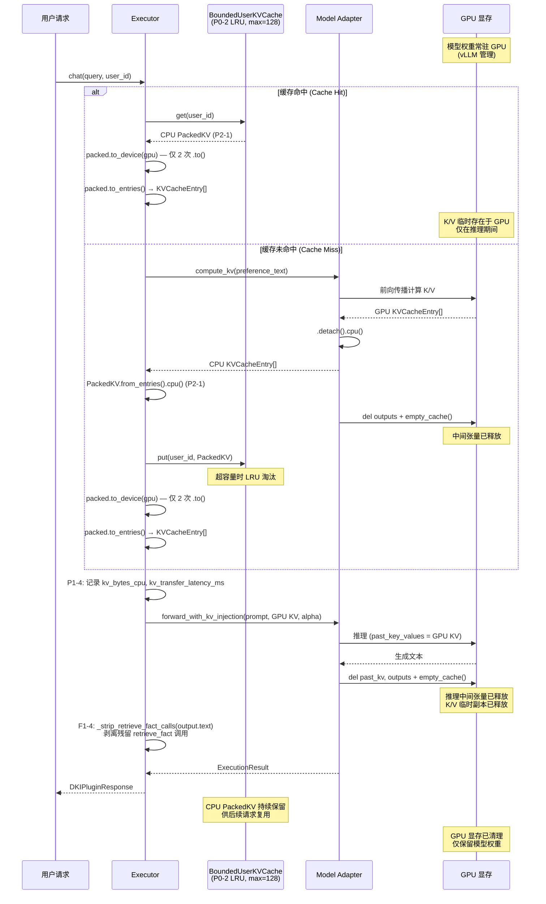
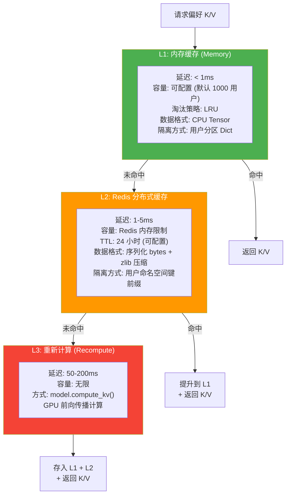
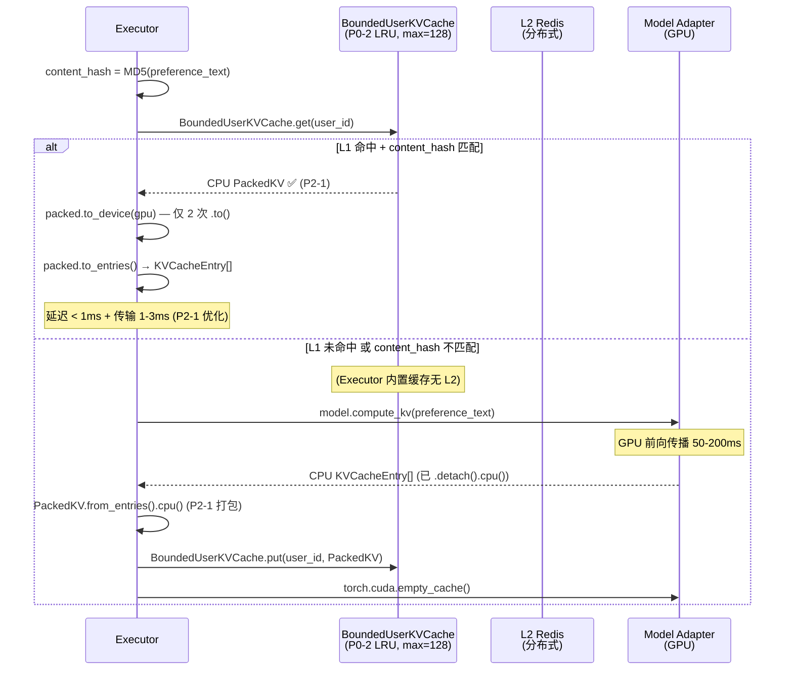
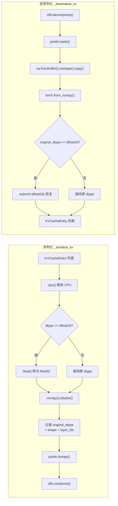

# DKI 偏好注入完整流程说明书

# DKI Preference K/V Injection — Complete Flow Specification

> 版本 / Version: 4.1.0 (P0-P2 + F1 融合权重优化后)  
> 最后更新 / Last Updated: 2026-02-18  
> 核心文件 / Core Files:
>
> -   `dki/core/plugin/injection_executor.py` — Executor 偏好 K/V 获取与注入 (含 BoundedUserKVCache P0-2)
> -   `dki/cache/preference_cache.py` — 三级缓存管理器
> -   `dki/cache/user_isolation.py` — 用户隔离缓存管理器
> -   `dki/models/base.py` — KVCacheEntry + PackedKV (P2-1) 数据结构
> -   `dki/models/vllm_adapter.py` — 模型适配器 compute_kv / forward_with_kv_injection

---

## 1. 偏好注入完整流程 / Complete Preference Injection Flow

### 1.1 中文版 Mermaid



### 1.2 English Mermaid

```mermaid
flowchart TD
    START([User request arrives at Executor]) --> HAS_PREF{Has preference_text<br/>AND injection_enabled?}

    HAS_PREF -->|No| PLAIN[model.generate<br/>No-injection inference]
    HAS_PREF -->|Yes| GET_KV

    subgraph KV_ACQUISITION["Preference K/V Acquisition (P0-2 + P2-1)"]
        GET_KV[_get_preference_kv<br/>user_id + preference_text] --> VALIDATE{user_id non-empty?}

        VALIDATE -->|Empty| COMPUTE_NOCACHE[model.compute_kv<br/>No caching]
        VALIDATE -->|Non-empty| HASH[Compute content_hash<br/>MD5 of preference_text]

        HASH --> PARTITION{"BoundedUserKVCache (P0-2)<br/>cache hit?<br/>(LRU eviction, max=128)"}

        PARTITION -->|Hit| UNPACK["Retrieve CPU PackedKV (P2-1)<br/>packed.to_device(gpu)<br/>→ Only 2 .to() calls<br/>packed.to_entries()<br/>→ Unpack to KVCacheEntry[]"]

        PARTITION -->|Miss| COMPUTE[model.compute_kv<br/>Compute on GPU]
        COMPUTE --> DETACH["key.detach().cpu()<br/>value.detach().cpu()<br/>Move K/V to CPU"]
        DETACH --> PACK["PackedKV.from_entries() (P2-1)<br/>32 layers K/V → 2 contiguous Tensors<br/>packed.cpu()"]
        PACK --> STORE["Store in BoundedUserKVCache<br/>(LRU eviction on overflow)"]
        STORE --> CLEANUP1["torch.cuda.empty_cache()<br/>Free GPU intermediate tensors"]
    end

    UNPACK --> KV_METRICS
    CLEANUP1 --> RETURN_KV[Return K/V on GPU]
    COMPUTE_NOCACHE --> RETURN_KV
    RETURN_KV --> KV_METRICS

    KV_METRICS["P1-4: Record KV monitoring metrics<br/>kv_bytes_cpu / kv_transfer_latency_ms"]

    KV_METRICS --> ALPHA_CHECK{alpha > 0.1?}
    ALPHA_CHECK -->|No| PLAIN
    ALPHA_CHECK -->|Yes| GUARD

    subgraph INFERENCE["K/V Injection Inference"]
        GUARD{InferenceContextGuard<br/>available?}
        GUARD -->|Yes| SCOPED["scoped_inference<br/>User-isolated inference context"]
        GUARD -->|No| DIRECT[Direct inference]

        SCOPED --> FWD["model.forward_with_kv_injection<br/>prompt + injected_kv + alpha"]
        DIRECT --> FWD

        FWD --> FWD_DETAIL["1. tokenize prompt → GPU<br/>2. K/V already on GPU (PackedKV transfer)<br/>3. alpha scales Value tensor<br/>   (Key NEVER scaled!)<br/>4. past_key_values = injected_kv<br/>5. model.generate with past_kv<br/>6. Generate text"]

        FWD_DETAIL --> POST_CLEANUP["del past_kv, outputs<br/>torch.cuda.empty_cache()<br/>Free inference intermediate tensors"]
    end

    POST_CLEANUP --> STRIP_FACT["F1-4: _strip_retrieve_fact_calls<br/>Strip residual retrieve_fact calls<br/>(Generic/DeepSeek/GLM formats)"]
    PLAIN --> STRIP_PLAIN["F1-4: Defensive interception<br/>Strip residual tool calls"]

    STRIP_FACT --> RESULT([Return ExecutionResult])
    STRIP_PLAIN --> RESULT

    style START fill:#4CAF50,color:#fff
    style RESULT fill:#2196F3,color:#fff
    style KV_ACQUISITION fill:#FFF3E0
    style INFERENCE fill:#E3F2FD
```



---

## 2. 偏好 K/V 是否需要常驻 GPU？/ Does Preference K/V Need to Stay on GPU?

### 2.1 结论 / Conclusion

**❌ 偏好 K/V 不需要常驻 GPU，也不应该常驻 GPU。**

**❌ Preference K/V does NOT need to reside on GPU permanently, and SHOULD NOT.**

### 2.2 设计原理 / Design Rationale

| 问题                   | 说明                                                                                                                                                                                               |
| ---------------------- | -------------------------------------------------------------------------------------------------------------------------------------------------------------------------------------------------- |
| **为什么不常驻 GPU？** | 每个用户的偏好 K/V 约占 **50-200MB GPU 显存**（取决于模型层数和 hidden_dim）。如果 100 个活跃用户的 K/V 同时常驻 GPU，将占用 **5-20GB**，这对于 32GB 的 GPU 来说是不可接受的。                     |
| **当前方案**           | K/V 计算后立即 `.detach().cpu()` 移到 CPU，打包为 `PackedKV` (P2-1) 存入 `BoundedUserKVCache` (P0-2)。推理时按需 `packed.to_device()` 移到 GPU（仅 2 次调用），推理完成后 GPU 上的临时副本被释放。 |
| **性能影响**           | CPU→GPU 传输延迟约 **1-3ms**（P2-1 优化后，仅 2 次传输），相比推理延迟 **100-500ms** 可以忽略不计。                                                                                                |
| **安全考虑**           | GPU 显存是共享资源。不同用户的 K/V 如果常驻 GPU，存在跨用户数据泄露风险。CPU 缓存按用户分区隔离更安全。                                                                                            |

### 2.3 K/V 生命周期图 / K/V Lifecycle Diagram



### 2.4 显存占用估算 / GPU Memory Estimation

以 DeepSeek-7B 为例（32 层, 32 头, head_dim=128, float16）:

| 项目            | 计算                              | 大小              |
| --------------- | --------------------------------- | ----------------- |
| 单层 Key        | `[1, 32, seq_len, 128]` × 2 bytes | `seq_len × 8KB`   |
| 单层 Value      | `[1, 32, seq_len, 128]` × 2 bytes | `seq_len × 8KB`   |
| 32 层 K+V       | `32 × 2 × seq_len × 8KB`          | `seq_len × 512KB` |
| 偏好 20 tokens  | `20 × 512KB`                      | **~10MB**         |
| 偏好 100 tokens | `100 × 512KB`                     | **~50MB**         |
| 偏好 500 tokens | `500 × 512KB`                     | **~250MB**        |

**结论**: 即使是短偏好文本，K/V 也占用可观的显存。常驻 GPU 不可行。

**PackedKV 优化效果 (P2-1)**: CPU 存储大小不变，但 CPU→GPU 传输从 64 次独立 `.to(device)` 调用减少为 2 次（1 次 packed_key + 1 次 packed_value），减少了 CUDA 驱动调用开销和内存碎片。

---

## 3. 当前缓存方案详解 / Current Caching Architecture

### 3.1 三级缓存架构 / Three-Tier Cache Architecture



### 3.2 两套缓存实现 / Two Cache Implementations

DKI 系统中存在两套偏好 K/V 缓存，分别用于不同场景:

#### 3.2.1 Executor 内置缓存 (`injection_executor.py`) — v3.4 BoundedUserKVCache + PackedKV

```python
# P0-2: BoundedUserKVCache 替代无界 Dict
class BoundedUserKVCache:
    max_entries: int = 128          # 最多缓存 128 个用户
    max_bytes: int = 2 * 1024**3    # CPU 内存上限 2GB
    _store: OrderedDict             # LRU 淘汰

# P2-1: PackedKV 替代 List[KVCacheEntry]
# 存储格式: user_id → (PackedKV, content_hash, timestamp)
self._preference_kv_cache = BoundedUserKVCache(max_entries=128, max_bytes=2*1024**3)
```

| 特性         | 说明                                                  |
| ------------ | ----------------------------------------------------- |
| **层级**     | 仅 L1 (内存)                                          |
| **隔离**     | 按 user_id 物理分区                                   |
| **存储格式** | CPU PackedKV (P2-1: 32 层 K/V 打包为 2 个连续 Tensor) |
| **淘汰策略** | LRU 自动淘汰 (P0-2: max_entries=128, max_bytes=2GB)   |
| **适用场景** | 单实例部署，生产环境                                  |
| **使用方**   | `InjectionExecutor._get_preference_kv()`              |
| **CPU→GPU**  | 仅 2 次 `.to(device)` 调用 (P2-1: 原 64 次 → 2 次)    |

**缓存键生成**:

```python
content_hash = hashlib.md5(preference_text.encode()).hexdigest()
# 缓存路径: BoundedUserKVCache.get(user_id) → (PackedKV, content_hash, ts)
```

**缓存未命中时的存储 (PackedKV)**:

```python
# model.compute_kv() 返回 List[KVCacheEntry] (CPU tensors)
kv_entries, _ = self.model.compute_kv(preference_text)

# P2-1: 打包为 PackedKV (2 个连续 Tensor)
packed = PackedKV.from_entries(kv_entries)  # 32 层 → 2 个 Tensor
packed_cpu = packed.cpu()                   # 确保在 CPU

# P0-2: 存入 BoundedUserKVCache (超容量自动 LRU 淘汰)
self._preference_kv_cache.put(user_id, packed_cpu, content_hash)
```

**缓存命中时的设备迁移 (PackedKV)**:

```python
# 从 BoundedUserKVCache 取出 PackedKV
packed_cpu, cached_hash = self._preference_kv_cache.get(user_id)

# P2-1: 仅 2 次 .to(device) 调用 (而非 64 次)
device = getattr(self.model, 'device', 'cpu')
packed_gpu = packed_cpu.to_device(device)   # 1 次 key + 1 次 value

# 解包回 List[KVCacheEntry] 供模型使用
kv_entries = packed_gpu.to_entries()
```

#### 3.2.2 PreferenceCacheManager (`preference_cache.py`)

```python
# L1: LRU 缓存 (OrderedDict)
self._l1_cache = LRUCache(maxsize=config.l1_max_size)
# L2: Redis 分布式缓存
self._redis_client = redis_client
```

| 特性            | 说明                                         |
| --------------- | -------------------------------------------- |
| **层级**        | L1 (内存 LRU) + L2 (Redis) + L3 (重新计算)   |
| **隔离**        | 缓存键 = `{user_id}:{preference_hash}`       |
| **L1 存储格式** | CacheEntry (含 KV 数据 + 元数据)             |
| **L2 存储格式** | pickle + zlib 压缩的 bytes                   |
| **淘汰策略**    | L1: LRU (默认 1000 条), L2: TTL (默认 24h)   |
| **适用场景**    | 多实例部署，生产环境                         |
| **使用方**      | `DKIPlugin.__init__` 中创建，供监控 API 使用 |

**Redis 键格式**:

```
dki:pref_kv:{user_id}:{preference_hash}
```

#### 3.2.3 IsolatedPreferenceCacheManager (`user_isolation.py`)

```python
# L1: UserScopedCacheStore (用户级物理分区)
self._l1_store = UserScopedCacheStore(config=isolation_config)
# L2: Redis (带 HMAC 签名键)
self._redis_client = redis_client
```

| 特性         | 说明                                           |
| ------------ | ---------------------------------------------- |
| **层级**     | L1 (用户分区内存) + L2 (Redis) + L3 (重新计算) |
| **隔离**     | 物理分区 + HMAC 签名键 + 推理上下文守卫        |
| **安全级别** | 最高 (含审计日志)                              |
| **适用场景** | 安全敏感的多租户部署                           |

### 3.3 缓存查找流程 / Cache Lookup Flow



### 3.4 序列化与反序列化 / Serialization

当 K/V 需要存入 Redis (L2) 时，需要序列化:



**关键点**:

-   `bfloat16` 没有 numpy 等价类型，必须先转为 `float32` 再序列化
-   反序列化时通过 `original_dtype` 字段恢复原始精度
-   使用 `.copy()` 避免 numpy 只读缓冲区问题

---

## 4. 推理完成后的显存清理方式 / GPU Memory Cleanup After Inference

### 4.1 清理策略总览 / Cleanup Strategy Overview

```mermaid
flowchart TD
    subgraph COMPUTE["compute_kv 阶段"]
        C1["model(**inputs, use_cache=True)"] --> C2["提取 past_key_values"]
        C2 --> C3["key.detach().cpu()<br/>value.detach().cpu()"]
        C3 --> C4["del outputs"]
        C4 --> C5["torch.cuda.empty_cache()"]
    end

    subgraph INFERENCE["forward_with_kv_injection 阶段"]
        I1["injected_kv.to(device)<br/>临时移到 GPU"] --> I2["model.generate<br/>with past_key_values"]
        I2 --> I3["del past_kv, outputs"]
        I3 --> I4["torch.cuda.empty_cache()"]
    end

    subgraph CACHE_STORE["缓存存储阶段"]
        CS1["计算完成的 K/V"] --> CS2["CPU tensor 存入缓存"]
        CS2 --> CS3["GPU 上的原始 K/V<br/>已在 compute_kv 中释放"]
    end

    style COMPUTE fill:#FFECB3
    style INFERENCE fill:#BBDEFB
    style CACHE_STORE fill:#C8E6C9
```



### 4.2 各环节详细清理操作 / Detailed Cleanup at Each Stage

#### 4.2.1 `model.compute_kv()` — K/V 计算阶段

```python
# 文件: dki/models/vllm_adapter.py (及 deepseek/glm/llama_adapter.py)

def compute_kv(self, text, return_hidden=False):
    inputs = self.tokenize(text)  # → GPU

    with torch.no_grad():  # ← 禁用梯度计算，减少显存
        outputs = self.hf_model(**inputs, use_cache=True, return_dict=True)

    # ① 提取 K/V 并立即移到 CPU
    kv_entries = []
    for layer_idx, (key, value) in enumerate(outputs.past_key_values):
        entry = KVCacheEntry(
            key=key.detach().cpu(),      # ← detach 断开计算图 + 移到 CPU
            value=value.detach().cpu(),   # ← 同上
            layer_idx=layer_idx,
        )
        kv_entries.append(entry)

    # ② 删除中间张量
    del outputs  # ← 释放 GPU 上的 outputs (含 logits, hidden_states 等)

    # ③ 清理 GPU 碎片
    if torch.cuda.is_available():
        torch.cuda.empty_cache()  # ← 释放 PyTorch 缓存的未使用显存块

    return kv_entries, hidden_states  # ← 返回的全是 CPU tensor
```

**清理效果**:

-   `detach()`: 断开与计算图的连接，允许 GC 回收梯度相关内存
-   `.cpu()`: 将 tensor 从 GPU 移到 CPU，释放 GPU 显存
-   `del outputs`: 释放 GPU 上的 logits、hidden_states 等中间结果
-   `empty_cache()`: 将 PyTorch 缓存的未使用显存块归还给 CUDA

#### 4.2.2 `Executor._get_preference_kv()` — 缓存管理阶段 (v3.4 PackedKV + BoundedUserKVCache)

```python
# 文件: dki/core/plugin/injection_executor.py

def _get_preference_kv(self, user_id, preference_text):
    content_hash = hashlib.md5(preference_text.encode()).hexdigest()
    device = getattr(self.model, 'device', 'cpu')

    # P0-2: 从 BoundedUserKVCache 查找
    cached = self._preference_kv_cache.get(user_id)
    if cached is not None:
        packed_kv, cached_hash = cached[0], cached[1]
        if cached_hash == content_hash:
            # P2-1: 仅 2 次 .to(device) 调用
            packed_gpu = packed_kv.to_device(device)
            kv_entries = packed_gpu.to_entries()
            return kv_entries, True, "memory"

    # 缓存未命中: 计算后存入 CPU 缓存
    kv_entries, _ = self.model.compute_kv(preference_text)  # ← 返回 CPU tensor

    # P2-1: 打包为 PackedKV (32 层 → 2 个连续 Tensor)
    packed = PackedKV.from_entries(kv_entries)
    packed_cpu = PackedKV(
        packed_key=packed.packed_key.cpu(),
        packed_value=packed.packed_value.cpu(),
        ...
    )

    # P0-2: 存入 BoundedUserKVCache (超容量自动 LRU 淘汰)
    self._preference_kv_cache.put(user_id, packed_cpu, content_hash)

    # 清理
    if torch.cuda.is_available():
        torch.cuda.empty_cache()

    # 为推理准备 GPU 版本
    packed_gpu = packed_cpu.to_device(device)
    kv_entries = packed_gpu.to_entries()
    return kv_entries, False, "compute"
```

#### 4.2.3 `model.forward_with_kv_injection()` — 推理阶段

```python
# 文件: dki/models/vllm_adapter.py (及 deepseek/glm/llama_adapter.py)

def forward_with_kv_injection(self, prompt, injected_kv, alpha, max_new_tokens, **kwargs):
    # ① 将 K/V 移到 GPU 并应用 alpha 缩放
    past_kv = []
    for entry in injected_kv:
        key = entry.key.to(self.device)        # ← CPU → GPU (临时)
        value = entry.value.to(self.device)     # ← CPU → GPU (临时)

        # 安全不变量: Key 永远不被 alpha 缩放 (保护 attention addressing)
        # 只缩放 Value
        value = value * alpha

        past_kv.append((key, value))

    past_kv = tuple(past_kv)

    # ② 推理
    inputs = self.tokenize(prompt)
    with torch.no_grad():
        outputs = self.model.generate(
            **inputs,
            past_key_values=past_kv,
            max_new_tokens=max_new_tokens,
            **kwargs,
        )

    # ③ 提取结果
    generated_text = self.decode(outputs[0])

    # ④ 清理 GPU 中间张量
    del past_kv    # ← 释放 GPU 上的临时 K/V 副本
    del outputs    # ← 释放 GPU 上的生成结果张量
    if torch.cuda.is_available():
        torch.cuda.empty_cache()

    return ModelOutput(text=generated_text, ...)

# ⑤ F1-4: Executor 侧防御性拦截 (在 _execute_with_kv_injection / _execute_plain 中)
# 文件: dki/core/plugin/injection_executor.py

# 模型输出后, 剥离残留的 retrieve_fact 工具调用
result.text, stripped_count = _strip_retrieve_fact_calls(result.text)
# 支持 3 种格式:
#   - Generic:  retrieve_fact(trace_id="...", ...)
#   - DeepSeek: <｜tool▁call▁begin｜>retrieve_fact\n{...}<｜tool▁call▁end｜>
#   - GLM:      <|tool_call|>retrieve_fact\n{...}
# stripped_count > 0 时记入 stats["fact_calls_stripped"]
```

### 4.3 显存生命周期时间线 / GPU Memory Lifecycle Timeline

```mermaid
gantt
    title GPU 显存占用时间线 (单次请求, v3.4 PackedKV)
    dateFormat X
    axisFormat %s

    section 模型权重
    模型权重 (常驻)                      :active, weights, 0, 100

    section compute_kv (缓存未命中时)
    前向传播中间张量                      :crit, fwd, 5, 15
    K/V 提取 (GPU→CPU)                   :done, extract, 15, 18
    PackedKV.from_entries().cpu() (P2-1)  :done, pack, 18, 19
    del outputs + empty_cache             :milestone, cleanup1, 19, 19

    section 推理准备 (P2-1 优化)
    PackedKV.to_device(gpu) — 2次调用     :active, kv_gpu, 25, 27
    PackedKV.to_entries() — 解包          :done, unpack, 27, 28
    K/V GPU 临时副本                      :active, kv_live, 28, 60

    section forward_with_kv_injection
    推理中间张量                          :crit, infer, 30, 55
    del past_kv + outputs                 :milestone, cleanup2, 55, 55
    empty_cache                           :milestone, cleanup3, 56, 56

    section 空闲
    GPU 仅保留模型权重                    :done, idle, 60, 100
```



### 4.4 清理操作汇总表 / Cleanup Operations Summary

| 阶段                        | 操作                                   | 目的                                    | 文件                    |
| --------------------------- | -------------------------------------- | --------------------------------------- | ----------------------- |
| `compute_kv`                | `key.detach().cpu()`                   | 断开计算图 + 移到 CPU                   | `*_adapter.py`          |
| `compute_kv`                | `del outputs`                          | 释放 GPU 中间张量                       | `*_adapter.py`          |
| `compute_kv`                | `torch.cuda.empty_cache()`             | 归还未使用显存块                        | `*_adapter.py`          |
| `_get_preference_kv`        | `PackedKV.from_entries().cpu()` (P2-1) | 打包 + 确保缓存在 CPU                   | `injection_executor.py` |
| `_get_preference_kv`        | `BoundedUserKVCache.put()` (P0-2)      | 存入有界缓存 (超限自动 LRU 淘汰)        | `injection_executor.py` |
| `_get_preference_kv`        | `torch.cuda.empty_cache()`             | 计算后清理                              | `injection_executor.py` |
| `_get_preference_kv` (命中) | `packed.to_device(gpu)` (P2-1)         | 仅 2 次 CPU→GPU 传输 (原 64 次)         | `injection_executor.py` |
| `forward_with_kv_injection` | `del past_kv, outputs`                 | 释放推理临时张量                        | `*_adapter.py`          |
| `forward_with_kv_injection` | `torch.cuda.empty_cache()`             | 归还未使用显存块                        | `*_adapter.py`          |
| `_compute_kv` (缓存管理器)  | `torch.cuda.empty_cache()`             | 计算后防御性清理                        | `preference_cache.py`   |
| `_compute_kv` (异常路径)    | `torch.cuda.empty_cache()`             | 异常时也清理                            | `preference_cache.py`   |
| `_execute_*` (所有路径)     | `_strip_retrieve_fact_calls()` (F1-4)  | 剥离模型输出中残留的 retrieve_fact 调用 | `injection_executor.py` |

---

## 5. 安全不变量 / Safety Invariants

### 5.1 K/V 注入安全规则

| 规则               | 说明                                                                                     | 保证方                              |
| ------------------ | ---------------------------------------------------------------------------------------- | ----------------------------------- |
| **Key 不缩放**     | `alpha` 仅应用于 Value tensor，Key 保持原值。这保护了 attention addressing 的准确性。    | `InjectionExecutor` + Model Adapter |
| **Alpha 上限**     | `effective_preference_alpha = min(alpha, override_cap=0.7)`，防止偏好覆盖查询意图。      | `AlphaProfile`                      |
| **用户隔离**       | 不同用户的 K/V 存储在独立的物理分区中，即使 content_hash 相同也不共享。                  | `BoundedUserKVCache` (P0-2)         |
| **推理上下文隔离** | `InferenceContextGuard` 确保推理前后无 K/V 残留泄露。                                    | `InferenceContextGuard`             |
| **HMAC 签名键**    | Redis 缓存键使用 HMAC 签名，防止键名猜测/构造攻击。                                      | `CacheKeySigner`                    |
| **F1-4 输出过滤**  | Executor 所有执行路径均剥离模型输出中残留的 `retrieve_fact` 工具调用，防止混淆终端用户。 | `_strip_retrieve_fact_calls()`      |

### 5.2 显存安全规则

| 规则                     | 说明                                                               |
| ------------------------ | ------------------------------------------------------------------ |
| **K/V 不常驻 GPU**       | 缓存始终存储 CPU PackedKV (P2-1)，推理时按需 `to_device()` 迁移    |
| **推理后必清理**         | 每次 `forward_with_kv_injection` 后必须 `del + empty_cache`        |
| **异常路径也清理**       | `_compute_kv` 的 except 块中也调用 `empty_cache()`                 |
| **torch.no_grad()**      | 所有 K/V 计算和推理都在 `no_grad()` 上下文中，不保留梯度           |
| **有界缓存 (P0-2)**      | `BoundedUserKVCache` 限制 max_entries=128, max_bytes=2GB，防止 OOM |
| **PackedKV 传输 (P2-1)** | 仅 2 次 `.to(device)` 调用替代 64 次，减少 CUDA 内存碎片和传输开销 |

---

## 6. 完整示例 / Complete Example

### 6.1 偏好注入完整数据流示例

```
═══════════════════════════════════════════════════════════
场景: 用户 "user_123" 首次请求 (缓存未命中)
偏好: "素食主义者, 不吃辣\n喜欢安静的环境"
═══════════════════════════════════════════════════════════

Step 1: Executor._get_preference_kv("user_123", "- 饮食: 素食主义者, 不吃辣\n- 氛围: 喜欢安静的环境")

  content_hash = MD5("- 饮食: 素食主义者, 不吃辣\n- 氛围: 喜欢安静的环境")
             = "a1b2c3d4e5f67890"

  BoundedUserKVCache.get("user_123") → None (首次)    # P0-2
  → 缓存未命中

Step 2: model.compute_kv(preference_text)

  GPU 操作:
    tokenize("- 饮食: 素食主义者, 不吃辣\n- 氛围: 喜欢安静的环境")
    → input_ids: [1, 532, 18234, ...] (20 tokens)
    → 移到 GPU

    model(**inputs, use_cache=True)
    → outputs.past_key_values: 32 层 × (key, value)
    → 每层 key shape: [1, 32, 20, 128] (float16)
    → 每层 value shape: [1, 32, 20, 128] (float16)
    → 单层 K+V 大小: 2 × 1 × 32 × 20 × 128 × 2 bytes = 320KB
    → 32 层总计: 32 × 320KB = 10MB GPU 显存

  CPU 迁移:
    for layer in 32 layers:
        key.detach().cpu()   → CPU tensor
        value.detach().cpu() → CPU tensor

  清理:
    del outputs              → 释放 GPU 上的 logits 等
    torch.cuda.empty_cache() → 归还 ~10MB + 中间张量

  返回: 32 个 KVCacheEntry (全部在 CPU)

Step 3: PackedKV 打包 + 存入缓存 (P2-1 + P0-2)

  PackedKV.from_entries(kv_entries):                   # P2-1
    32 个 key tensor flatten → 1 个 packed_key (连续)
    32 个 value tensor flatten → 1 个 packed_value (连续)
    → packed_cpu = PackedKV(packed_key.cpu(), packed_value.cpu(), ...)

  BoundedUserKVCache.put("user_123", packed_cpu, "a1b2c3d4e5f67890")  # P0-2
    → 当前缓存: 1/128 entries, ~10MB/2GB

  CPU 内存占用: packed_key + packed_value = ~10MB (与原方式相同)

Step 4: forward_with_kv_injection

  K/V 迁移到 GPU (PackedKV 优化):                      # P2-1
    packed_gpu = packed_cpu.to_device("cuda:0")
    → 仅 2 次 .to() 调用 (原方案: 32×2 = 64 次)
    → GPU 临时占用: ~10MB
    kv_entries = packed_gpu.to_entries()               # 解包回 32 层

  Alpha 缩放:
    value = value * 0.4  (仅 Value, Key 不变!)

  推理:
    model.generate(prompt, past_key_values=past_kv, max_new_tokens=512)
    → GPU 推理中间张量: ~500MB (取决于 prompt 长度)
    → 生成 "推荐'绿野仙踪'素食餐厅..."

  清理:
    del past_kv              → 释放 GPU 上的 ~10MB K/V 临时副本
    del outputs              → 释放 GPU 上的 ~500MB 推理中间张量
    torch.cuda.empty_cache() → 归还所有未使用显存块

  F1-4 防御性拦截:
    _strip_retrieve_fact_calls(output.text)
    → 扫描 Generic/DeepSeek/GLM 三种 retrieve_fact 格式
    → stripped_count = 0 (模型未生成残留调用)

  GPU 显存状态: 仅保留模型权重 (~14GB for 7B model)

═══════════════════════════════════════════════════════════
场景: 同一用户 "user_123" 第二次请求 (缓存命中)
═══════════════════════════════════════════════════════════

Step 1: Executor._get_preference_kv("user_123", same_text)

  content_hash = "a1b2c3d4e5f67890" (相同)

  BoundedUserKVCache.get("user_123")                   # P0-2
  → 命中! ✅ cached_hash == content_hash

  CPU → GPU 迁移 (PackedKV 优化):                       # P2-1
    packed_gpu = packed_cpu.to_device("cuda:0")
    → 仅 2 次 .to() 调用 (原方案: 64 次)
    kv_entries = packed_gpu.to_entries()
    → GPU 临时占用: ~10MB
    → 延迟: ~1-3ms (PCIe 传输, 优于原 64 次的 ~5ms)

  → 跳过 compute_kv，节省 50-200ms!

Step 2: forward_with_kv_injection (同上)
  → 推理 + 清理
```

### 6.2 缓存失效示例

```python
# 当用户偏好更新时，需要清除缓存

# 方式 1: 通过 Executor 清除 (P0-2: BoundedUserKVCache)
dki.executor.clear_preference_cache(user_id="user_123")
# → BoundedUserKVCache.evict("user_123")

# 方式 2: 通过 DKIPlugin 清除 (含偏好文本缓存 P1-3 + KV 缓存 + Redis)
await dki.invalidate_user_cache(user_id="user_123")
# → P1-3: 清除 _preference_text_cache 中 user_123 的条目
# → P0-2: BoundedUserKVCache.evict("user_123")
# → L1: 删除 PreferenceCacheManager 中 user_123:* 前缀的所有条目
# → L2: 删除 Redis 中 dki:pref_kv:user_123:* 的所有键

# 方式 3: 清除所有缓存
dki.executor.clear_preference_cache()  # 清除所有用户 (BoundedUserKVCache.clear())
await dki._preference_cache.clear_all()  # 清除 L1 + L2
```

---

## 7. 配置参考 / Configuration Reference

### 7.1 缓存配置 (`config.yaml`)

```yaml
# 偏好缓存配置 (PreferenceCacheManager)
preference_cache:
    l1_max_size: 1000 # L1 最大用户数
    l1_max_memory_mb: 5000 # L1 最大内存 (MB)
    l2_enabled: true # 启用 Redis L2 缓存
    l2_ttl_seconds: 86400 # L2 TTL (24小时)
    l2_key_prefix: "dki:pref_kv"
    enable_compression: true # 启用 zlib 压缩
    compression_level: 6 # 压缩级别 (1-9)

# Executor 内置缓存配置 (P0-2: BoundedUserKVCache)
executor_kv_cache:
    max_entries: 128 # 最多缓存 128 个用户的偏好 KV
    max_bytes: 2147483648 # CPU 内存上限 2GB

# 偏好文本缓存配置 (P1-3)
preference_text_cache:
    max_size: 256 # 最多缓存 256 个用户的偏好文本
    ttl_seconds: 300 # 5 分钟 TTL

# Redis 配置
redis:
    enabled: true
    host: localhost
    port: 6379
    db: 0
    password: ""
    key_prefix: "dki:"
    connection_timeout: 5
    socket_timeout: 3

# DKI 注入配置
dki:
    hybrid_injection:
        preference:
            alpha: 0.4 # 偏好注入强度
            max_tokens: 200 # 偏好最大 token 数
```

### 7.2 环境变量

```bash
# 如果 PyTorch 报告 "reserved but unallocated memory is large"
export PYTORCH_CUDA_ALLOC_CONF=expandable_segments:True
```
